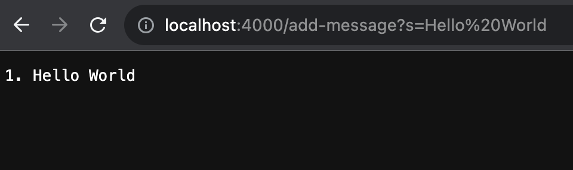
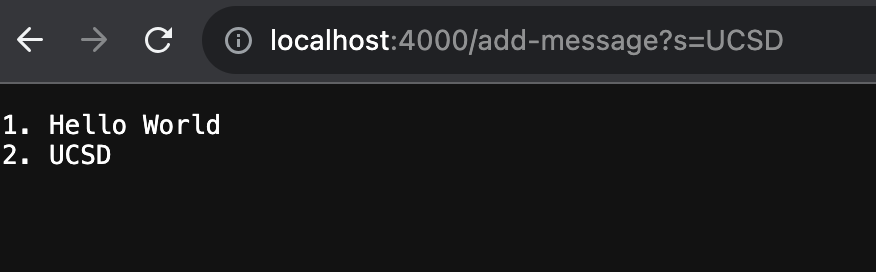

<style>
    .img {
        width:10px;
    }
</style>

## Part 1

Code for StringServer.java:

```
import java.io.IOException;
import java.net.URI;

class StringServer {
    public static void main(String[] args) throws IOException{
        if (args.length == 0) {
            System.out.println("Error: enter a port.");
            return;
        }
        Server.start(Integer.parseInt(args[0]), new Handler());
    }
}

class Handler implements URLHandler {
    
    String message = "";
    int num = 1;

    public String handleRequest(URI url) {

        if (url.getPath().contains("/add-message")) {

            String[] parameters = url.getQuery().split("=");
            if (parameters[0].equals("s")) {
                message += num + ". " + parameters[1] + "\n";
                num++;
            }
        } else if (!url.getPath().equals("/")) {
            return "Error: path not found.\n";
        }

        return message;
    }
}
```

When making a request, the `handleRequest` method in the `Handler` class is called and recieves the entire request URL as input. 

The class `Handler` contains variables `message` and `num`, with `message` being an empty string and `num` containing the value 1.

The `handleRequest` method checks if the path for the URL contains `/add-message` and then checks if the query for the URL looks like this: `s=<string>`. The method then adds the `<string>` value in the query and its index value in `num` to the `message` variable followed by `\n`. Finally, the method returns the value in `message` for output.

When adding `/add-message?s=Hello World` to the URL and making a request to the server, `handleRequest` concatonates the current value of `num` and the string "hello world" followed by `\n` to the `message` variable. Then, `num` is increased by 1. so `num` goes from 1 to 2. The method returns the value in `message` and the server outputs that value which looks like this:

 {.img}

`num` changed from `1` to `2` and `message` changed from `""` to `"1. Hello World\n"`

When adding `/add-message?s=UCSD` and making another request, `handleRequest` concatonates "UCSD" and its current index value in `num` to the `message` variable which then gets output by the server.

 {.img}

`num` changed from `2` to `3` and `message` changed from `"1. Hello World\n"` to `"1. Hello World\n2. UCSD\n"`

## Part 2

## Part 3
