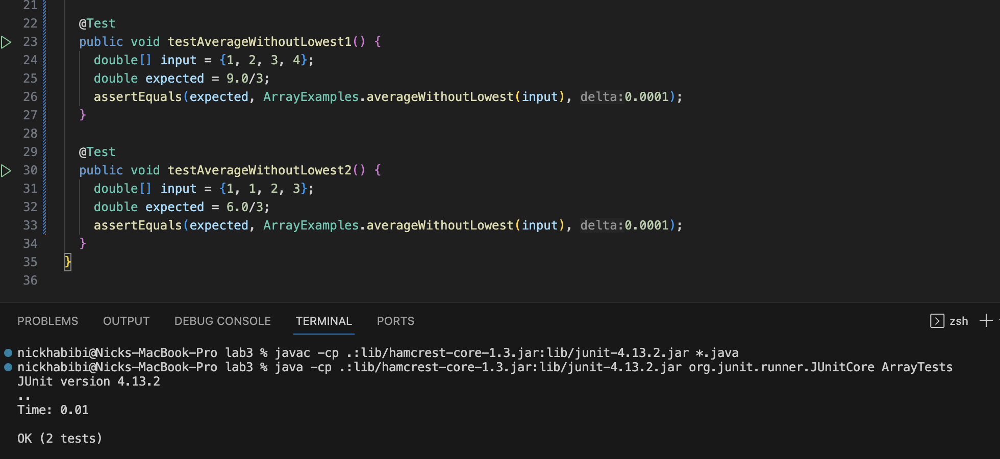

code {
  white-space : pre-wrap !important;
}

# Lab Report 3

## Part 1

The method we are testing returns the average value of the numbers in an array, but leaves out the lowest number. The method returns 0 if the length of the array is 0 or 1.

```
static double averageWithoutLowest(double[] arr) {
  if(arr.length < 2) { return 0.0; }
  double lowest = arr[0];
  for(double num: arr) {
    if(num < lowest) { lowest = num; }
  }
  double sum = 0;
  for(double num: arr) {
    if(num != lowest) { sum += num; }
  }
  return sum / (arr.length - 1);
}
```


JUnit test method for a failure inducing input:

```
@Test
public void testAverageWithoutLowest1() {
  double[] input = {1, 2, 3, 4};
  double expected = 9.0/3;
  assertEquals(expected, ArrayExamples.averageWithoutLowest(input), 0.0001);
}
```

JUnit test method for an input that doesn't induce a failure:

```
@Test
public void testAverageWithoutLowest1() {
  double[] input = {1, 1, 2, 3};
  double expected = 6.0/3;
  assertEquals(expected, ArrayExamples.averageWithoutLowest(input), 0.0001);
}
```

The symptom shown as the output of running the tests:


The bug is that when more than one numbers in the array are equally the lowest, all of them are left out from being added to the sum. To fix that, we can count all the other lowest numbers and add them to sum.

Before:

```
static double averageWithoutLowest(double[] arr) {
  if(arr.length < 2) { return 0.0; }
  double lowest = arr[0];
  for(double num: arr) {
    if(num < lowest) { lowest = num; }
  }
  double sum = 0;
  for(double num: arr) {
    if(num != lowest) { sum += num; }
  }
  return sum / (arr.length - 1);
}
```
After:

```
static double averageWithoutLowest(double[] arr) {
  if(arr.length < 2) { return 0.0; }
  double lowest = arr[0];
  for(double num: arr) {
    if(num < lowest) { lowest = num; }
  }
  double sum = 0;
  for(double num: arr) {
    if(num != lowest) { sum += num; }
  }

  int lowestCount = 0;
  for (double num: arr) {
    if(num == lowest) { lowestCount++; }
  }
  
  sum += (lowestCount - 1) * lowest;

  return sum / (arr.length - 1);
}
```

The new output from running the tests:



## Part 2

`grep` searches a file for particular strings or patterns, and outputs the lines containing that string or pattern.

### `-c`

This option only prints the count of the lines that contain the pattern

Examples:

```
nickhabibi@Nicks-MacBook-Pro docsearch % grep -c "government" technical/911report/chapter-1.txt
3
```

```
nickhabibi@Nicks-MacBook-Pro docsearch % grep -c "molecule" technical/biomed/1471-2172-3-16.txt    
23
```

`-c` is useful for quickly determining the number of times a pattern has occured.

### `-i`

This option ignores the case-sensitivity of patterns.

```
nickhabibi@Nicks-MacBook-Pro docsearch % grep -i "PROof" technical/911report/chapter-13.5.txt
            8. Tim Weiner, "U.S. Hard Put to Find Proof Bin Laden Directed Attacks," New York
                requirement of tamper-proof passports. Testimony of Thomas Ridge before the House
```

```
nickhabibi@Nicks-MacBook-Pro docsearch % grep -i "mediCINE" technical/biomed/gb-2003-4-9-r58.txt
        study of medicine and disease states by allowing for the
```

`-i` is useful for making case-insensitive searches and reduces the need for entering multiple patterns as input.

### `-l`

This option displays a list of filenames for files containing the specified pattern.

```
nickhabibi@Nicks-MacBook-Pro docsearch % grep -l "fruits" technical/biomed/*.txt
technical/biomed/1471-213X-3-3.txt
technical/biomed/1471-2164-3-9.txt
technical/biomed/1471-2431-2-4.txt
technical/biomed/1471-2458-3-11.txt
technical/biomed/1471-5945-1-3.txt
technical/biomed/1472-6882-1-10.txt
technical/biomed/1472-6882-1-7.txt
technical/biomed/1475-2891-2-1.txt
technical/biomed/bcr583.txt
```

```
nickhabibi@Nicks-MacBook-Pro docsearch %
grep -l "mandate" technical/plos/*.txt
technical/plos/journal.pbio.0020052.txt
technical/plos/journal.pbio.0020105.txt
technical/plos/journal.pbio.0020353.txt
technical/plos/pmed.0010039.txt
technical/plos/pmed.0010042.txt
technical/plos/pmed.0010046.txt
technical/plos/pmed.0010052.txt
technical/plos/pmed.0010060.txt
technical/plos/pmed.0010064.txt
technical/plos/pmed.0010066.txt
technical/plos/pmed.0020009.txt
```

`-l` is useful for locating files that contain specific patterns. It can also be used as input for commands like `xargs`.

### `-n`

This option shows the line number for line or lines containing the specified pattern.

```
nickhabibi@Nicks-MacBook-Pro docsearch % grep -n "mandate" technical/plos/pmed.0010039.txt
138:        recommend that employers be mandated to offer coverage to their employees. Others recommend
```

```
nickhabibi@Nicks-MacBook-Pro docsearch % grep "food" -n technical/biomed/bcr605.txt
675:        hormone replacement therapy could be eating foods or taking
```

`-n` is useful for locating specific lines in a file.

descriptions for all of the grep options above can be found here: 
https://www.geeksforgeeks.org/grep-command-in-unixlinux


