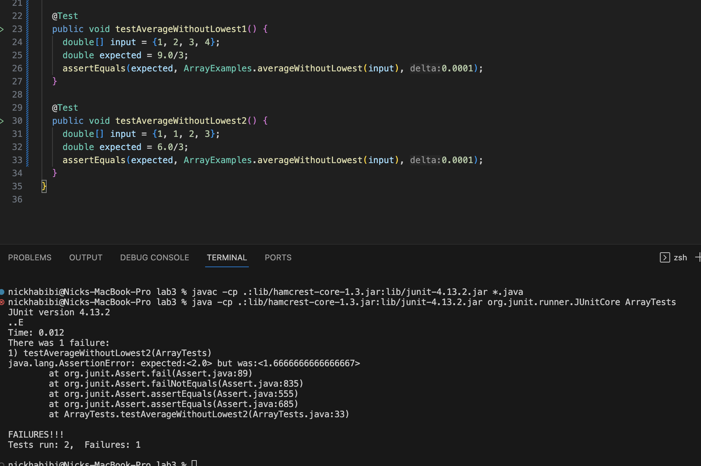

# Lab Report 3

## Part 1

The method we are testing returns the average value of the numbers in an array, but leaves out the lowest number. The method returns 0 if the length of the array is 0 or 1.

```
static double averageWithoutLowest(double[] arr) {
  if(arr.length < 2) { return 0.0; }
  double lowest = arr[0];
  for(double num: arr) {
    if(num < lowest) { lowest = num; }
  }
  double sum = 0;
  for(double num: arr) {
    if(num != lowest) { sum += num; }
  }
  return sum / (arr.length - 1);
}
```

JUnit test method for a failure inducing input:

```
@Test
public void testAverageWithoutLowest1() {
  double[] input = {1, 2, 3, 4};
  double expected = 9.0/3;
  assertEquals(expected, ArrayExamples.averageWithoutLowest(input), 0.0001);
}
```

JUnit test method for an input that doesn't induce a failure:

```
@Test
public void testAverageWithoutLowest1() {
  double[] input = {1, 2, 3, 4};
  double expected = 9.0/3;
  assertEquals(expected, ArrayExamples.averageWithoutLowest(input), 0.0001);
}
```

The symptom shown as the output of running the tests:



The bug is that when more than one numbers in the array are equally the lowest, all of them are left out from being added to the sum. To fix that, we can count all the other lowest numbers and add them to sum.

Before:

```
static double averageWithoutLowest(double[] arr) {
  if(arr.length < 2) { return 0.0; }
  double lowest = arr[0];
  for(double num: arr) {
    if(num < lowest) { lowest = num; }
  }
  double sum = 0;
  for(double num: arr) {
    if(num != lowest) { sum += num; }
  }
  return sum / (arr.length - 1);
}
```
After:

```
static double averageWithoutLowest(double[] arr) {
  if(arr.length < 2) { return 0.0; }
  double lowest = arr[0];
  for(double num: arr) {
    if(num < lowest) { lowest = num; }
  }
  double sum = 0;
  for(double num: arr) {
    if(num != lowest) { sum += num; }
  }

  int lowestCount = 0;
  for (double num: arr) {
    if(num == lowest) { lowestCount++; }
  }
  
  sum += (lowestCount - 1) * lowest;

  return sum / (arr.length - 1);
}
```

The new output from running the tests:


