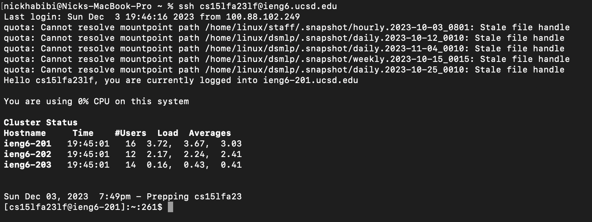
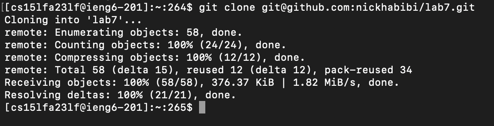
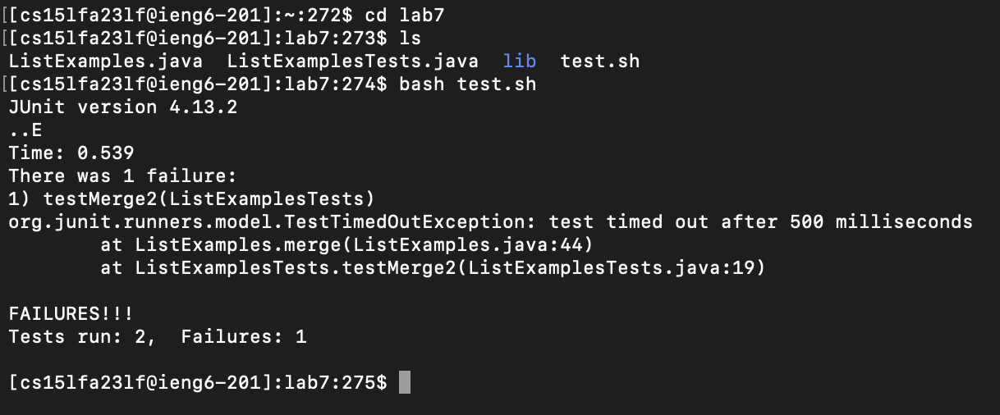
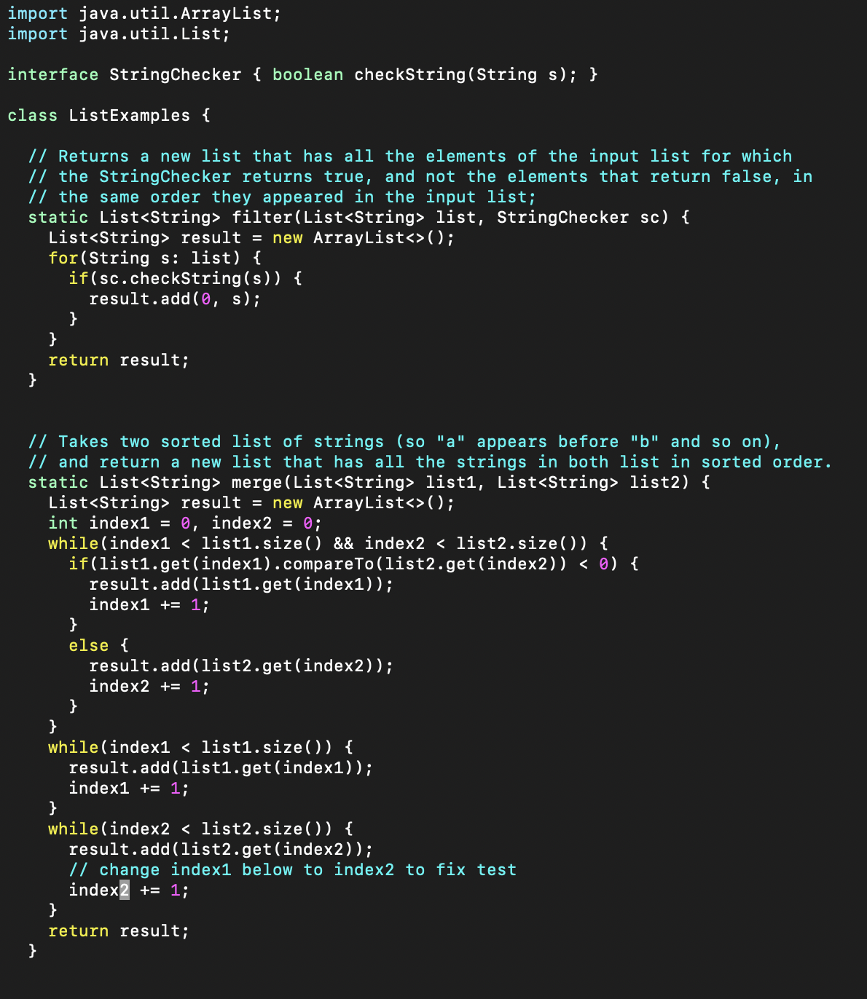
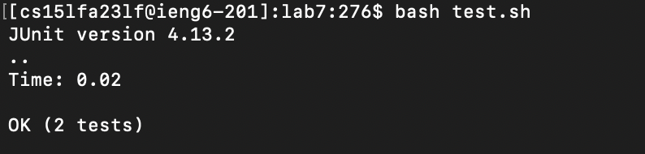
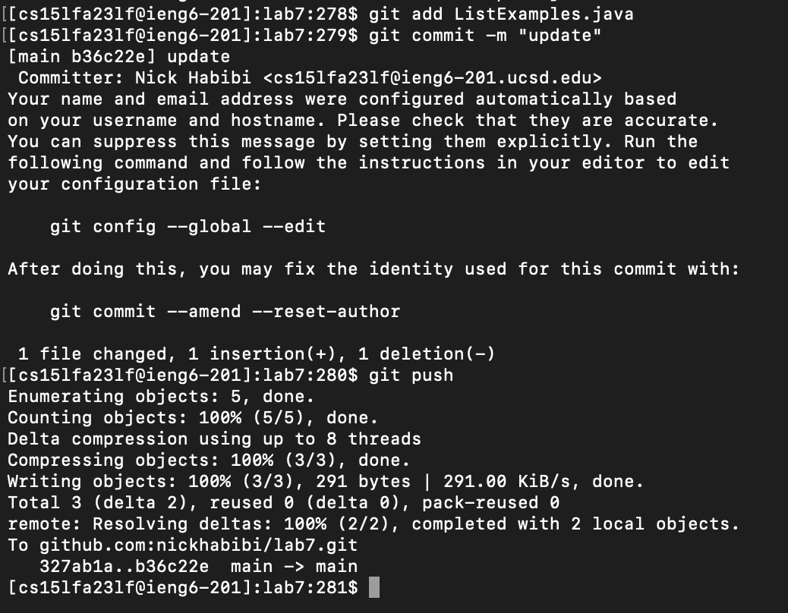

# Lab Report 4

In this lab report I will demonstrate the keys pressed to perform the tasks below:
1. logging into ieng6
2. cloning my fork of the repository from github
3. running the tests
4. editing the code to fix the failing test
5. running the tests again
6. committing and pushing the edited file to github.

## logging into ieng6

`<up><up><up><enter>`

the ssh command for logging into ieng6 was 3 up in search hisory.

## cloning my fork of the repository from github

git`<space>`clone`<space><command-v><enter>`

used `command-v` to paste the url for the github repository.

## running the tests

cd`<space>`lab7`<enter>`ls`<enter>`bash`<space>`test.sh`<enter>`

changed working directory to lab7 and ran test.sh

## editing the code to fix the failing test

vim`<space>`L`<tab>`.j`<tab><enter>`/index1`<enter>`nnnnnnnnner2:wq`<enter>`

pressed `<tab>` to autocomplete file name and extension and ran the vim command. pressed /index1 to search for index1 and pressed n until I reached the word that i want to change. pressed e to place the curser on '1'. changed '1' to '2' using r2. save and quit using :wq.

## running the tests again

`<up><up><enter>`

bash test.sh was 2 up in search history.

## committing and pushing the edited file to github.

git`<space>`add`<space>`L`<tab><enter>`git`<space>`commit`<space>`-m`<space>`"update"`<enter>`git`<space>`push`<enter>`

pressed `<tab>` to autocomplete filename. added, committed, and pushed to github.
